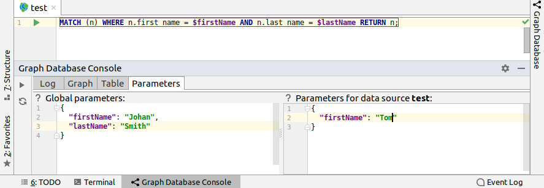

# Cypher

## Execution

Queries can be executed either for Cypher file (in this case data source selection is required), 
or from data source editor.
To open data source editor, right click on data source and choose `Open editor`.

Keyboard shortcut for query execution is *Ctrl + Enter* with the cursor on the query.
Alternatively right click on the query statement, select `Graph Database` -> `Execute Query`. 

If query execution fails, an error hint is displayed. 
 

The hint disappears as soon as any user interaction like mouse movement takes place.
Afterwards it is possible to view the error details in `Log` tab.

If parameters are needed for query execution, they can be provided in `Parameters` tab in JSON format.
For instance, for query `MATCH (n) WHERE n.firstName = $firstName RETURN n`, the 
parameter could look like `{"firstName": "Johan"}`.

Use the editor on the left to specify global parameters (will be applied to any opened data source 
when a query is executed).  
Use the editor on the right to override some parameters (and add others) for the data source
that is currently opened. Values are stored until the specific data source is deleted.

In this example, the name "Tom" will be used, since data source-specific parameters override global ones.

`Log` tab displays, what parameters were used for query execution.

<!--
General information
File type support
-->
